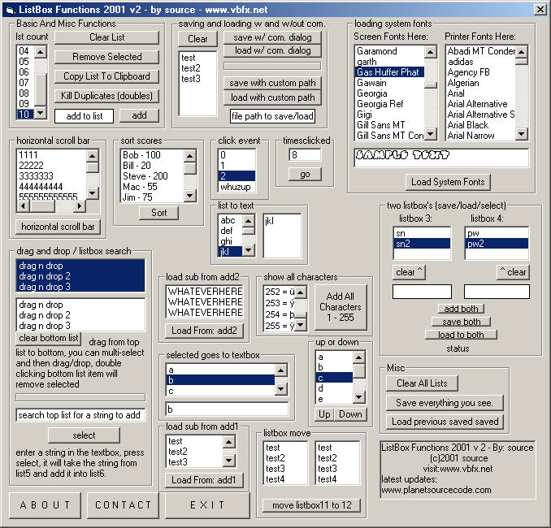



## \[A\+ ListBox Functions 2001 v\. 2\] \-  \*VERSION TWO\*

### Description

ListBox Functions 2001 Verision 2 - by: source 

This Example shows you over 33 different functions you can do with a listbox, the list is as follows: 

*-*Clear List 

*-*Remove Selected 

*-*Copy List To Clipboard 

*-*Kill Duplicates(Doubles) 

*-*Add To A List 

*-*Save List With Common Dialog 

*-*Save List w/Out Common Dialog 

*-*Load List With Common Dialog 

*-*Load List w/Out Common Dialog 

*-*Load System Screen Fonts To List 

*-*Load System Printer Fonts To List 

*-*Horizontal Scroll Bar To List 

*-*Sort Numbers(Score) In List 

*-*Click Event(msgbox) 

*-*Times List Was Clicked 

*-*Simple List To Text Conversion 

*-*Drag And Drop 

*-*Multi Select Drag And Drop 

*-*Search For String In Listbox 

*-*Load From Module 1 

*-*Load From Module 2(customizable) 

*-*Load All Characters(255) To List 

*-*Two Listbox's (Select one, Allign Other) 

*-*Save Two Listbox's With Common Dialog 

*-*Load Two Listbox's With Common Dialog 

*-*Select Item In List, Show In Textbox 

*-*Move A Selected Item Up Or Down in List 

*-*Move Contents of One List to Another 

*-*Clear All Listbox's By Form Name 

*-*Save/Load Whole Form 

 

Check out the screen shot for details...and please vote. 

-source 

www.vbfx.net 
 
### More Info
 
returns user with info on everything dealing with listbox's

this code is 100% safe for all users

             |
---                |---
**Submitted On**   |2001-04-09 23:21:06
**By**             |[source](https://github.com/Planet-Source-Code/PSCIndex/blob/master/ByAuthor/source.md)
**Level**          |Beginner
**User Rating**    |4.6 (324 globes from 71 users)
**Compatibility**  |VB 4\.0 \(16\-bit\), VB 4\.0 \(32\-bit\), VB 5\.0, VB 6\.0
**Category**       |[Miscellaneous](https://github.com/Planet-Source-Code/PSCIndex/blob/master/ByCategory/miscellaneous__1-1.md)
**World**          |[Visual Basic](https://github.com/Planet-Source-Code/PSCIndex/blob/master/ByWorld/visual-basic.md)
**Archive File**   |[\[A\+ ListBo18156492001\.zip](https://github.com/Planet-Source-Code/source-a-listbox-functions-2001-v-2-version-two__1-22078/archive/master.zip)

